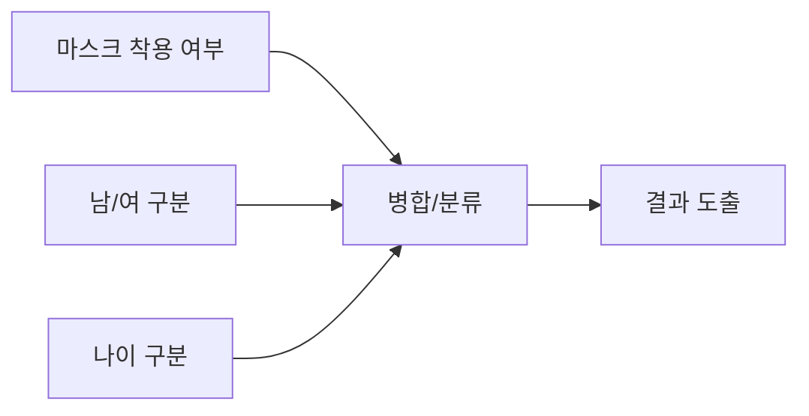

# 프로젝트 계획
---
### 프로젝트 팀 목표
##### 1. 점수를 목표
   * 령태 :  사실 1번이 모든 과정을 통합한 것이다.
##### 2. 실무 경험
   * 지훈: 여러명이 할 수 있는 작업을 경험해보고 싶다.
### 3. 모델이나 분석을 **깊게** 공부
   * 재민 : 문제 해결에서 이론이 정확히 돌아가는 구조를 파악하고 싶다.
   * 우진 : 모델 등에 대해 좀더 이해하고 사용하고 싶다. 후에 실질적으로 쓸모있는 방향이다.
   * 영덕 : task 자체가 어렵지 않아서 점수는 딱히.. task 가 어렵지 않을 때 각자 분석 후 여러 관점을 나눌 수 있다. 이게 협업이지
##### 4. 협업 경험을 좀더 **깊게** **엄밀하게**
---
### 프로젝트 타임라인
##### 1. 베이스라인 구축
##### 2. 개선안 분배 및 실험
   * 개선안 실험 결과는 기록 및 공유
   * 정리 해놓기
##### 3. 개선안 병합 및 세부조정
   * 제출물(회고록, 동료피드백, 랩업리포트)에 대한 기록 틈틈히 해놓기
##### 4. 2~3 반복
##### 5. 제출물(회고록, 동료피드백, 랩업리포트) 작성
---
### 베이스라인 후보
#### 여러 모델을 합쳐서 사용하자

#### CNN or Transformer?
* 학습 속도는 제출 기한만 맞추면 고려대상이 아님
* 심지어 (고성능) GPU 도 제공됨
* pre-trained 모델을 사용 가능하다면 transformer의 단점은 사라짐
* **만약 pre-trained 가 비허가된다면 CNN 사용하자..**
* **허가된다고 해도 train 이 필요시 CNN**
---
### 라이브러리
* **Pytorch**
  * 아직 파이토치도 제대로 못다룸
  * 그나마 익숙함
* **Poetry**
  * 버전관리 툴
  * 협업에 필수임
---
### 실험 공유 방식
#### Tensor Board
* 대중적임
* 서버랑 연결하기 쉬움
---
### etc